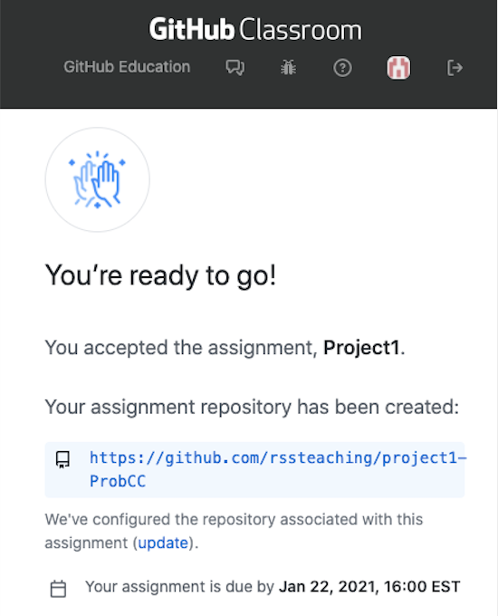

# CS503 XINU Projects Note

## XINU Lab
The XINU lab is located in *Haas257*. There are 21 Linux frontend machines *xinu01.cs.purdue.edu*, *xinu02.cs.purdue.edu*, ..., *xinu21.cs.purdue.edu* which are linked to 96 backend machines *galileo101.cs.purdue.edu*, *galileo102.cs.purdue.edu*, ..., *galileo196.cs.purdue.edu*. 


The front machines served as operating system *code development* (coding, compiling, etc) while the backend machines served as actual operating system *running platform* and it would be either accessed physicly or remotely via TLS/SSL applications such as **ssh** on Linux/MacOS/Windows or **PuTTY** for some early version Windows.  

The backend machines are **x86 Intel** Galileo boards equipped with *Quark X1000 processors* that are dedicated to running your implementation of XINU. 


## CS Account
Students registered in the course should have an account automatically set up. Please check by going to Haas257 or remote accessing one of the frontend lab machines. If you have registered but don't have an account, please contact [ScienceHelp@purdue.edu](ScienceHelp@purdue.edu).


## Project Assignments
The projects of this course will be publish through github. So, you need to: 
1. Have a github account.
2. Get familiar with some basic github operations. 

    The basic github commands such as `git clone`, `git status`, `git add`, `git commit` and `git push` would be good enough. We will cover those basic operations below.


## Walk through scheme for each project

1. Open the project link and accept the assignment.

    We would announce release the link through piazza or email. You just click the link and it might bring you to the following page.
    
   
    

    Accept it and keep next to reach the project page.    
    
    
    
    


2. Work on the project. 
    
    In case forget the project repo. You can go to [github.com/rssteaching/](https://github.com/rssteaching/) to find your project repo.
    Let's assume your project is under 'github.com/rssteaching/project1-jonsnow' and your name is `jonsnow`.
    
    
     2.1 login one of the 21 front machines, either physically or remotely.
    
        For example, open Terminal (of Linux/MacOS/Windows) or PuTTY and using the following command. `ssh jonsnow@xinu01.cs.purdue.edu`. Then fill in the password and login in the front machine.

2.2 If this is the first time login, we need to do some profile setting for the backend machine, to export PATH=${PATH}:/p/xinu/bin

If you don't want to manually set each time. You can also put the above line within the `~/.bashrc` file so that the environment variable would be automatically set each time you login. 


2.3 clone the project repo under your directory.

        For example,
        ```
        Mkdir -p ~/my503/; cd ~/my503/;
        Git clone sdfsd
        Cd project1   
        ```
        This project folder would be your project root directory.

2.4 Work on the project as needed. 
     

2.5 Compile the project
      The exist makefile already provided under `compile` folder.
       ```
        Cd ./xinu/compile
        Make
        # some times, you need to `make clean` before `make`
        
       ```
       If successfully compiled, a `xinu.xbin` file would be generated.

2.6 Connected to backend machine
        We use `cs-console` to connect to a backend machine. (For more details, check `cs-console -h`).  
        ```
        cs-console
        ```
        The console system will automatically connect you to one of the available machines. I.e. *connection 'galileo104', class 'quark', host 'xinuserver.cs.purdue.edu'*. Then use `control+shift+2` to trigger the command input mode.  (`d` for upload. `p` for reboot.)
```
(command-mode) d
file: xinu.xbin
```
And then 
```
(command-mode) p
file: xinu.xbin
```

    
    
    
    
    
    
    
    2.1 login one of the 21 front machines, physically or remotelly.
    
        For example, open Terminal (of Linux/MacOS/Windows) or PuTTY.
        ```
        $ ssh jonsnow@xinu01.cs.purdue.edu
        jonsnow@xinu01.cs.purdue.edu's password: YouKnowNothing
        
        

        
        ```

For each project assignments:
Open and accept the project link. 
Work on the project. 
Commit your changes and push before the deadline.


